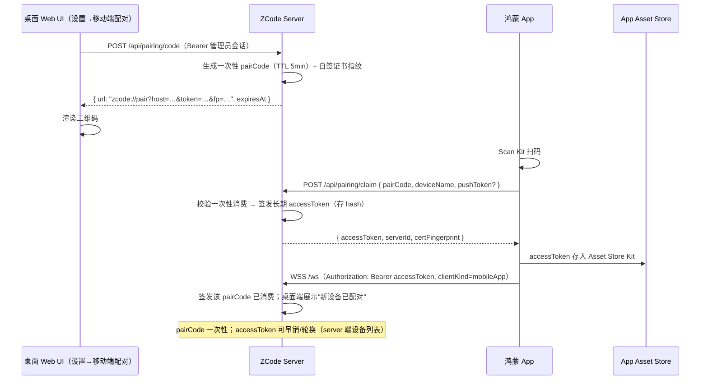
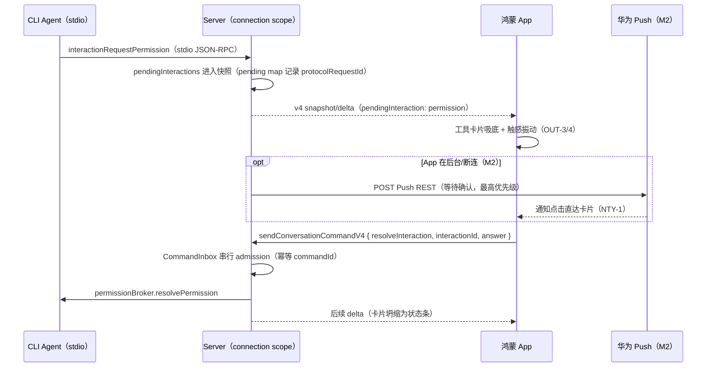

# ZCode Harmony 产品需求开发计划

| 项 | 内容 |
| --- | --- |
| 依据 | `docs/PRD-ZCode-Harmony.md`（PRD v1.0，2026-09-21） |
| 范围 | 本仓库（zcode fork）的 Server 端改造 + 协议层移植基线；鸿蒙 App（`F:\program\zcode-harmony`）的需求分解与排期 |
| 基线 | 分支 `feature/harmony-0.1`，基于 commit `872ad96 feat: open source`；基线检查通过（ahead 0 / behind 0） |
| 版本 | Plan v1.0（2026-09-21） |
| 读者 | 产品、server 端开发、鸿蒙开发 |

---

## 0. 现状分析结论（TL;DR）

对当前 checkout（server / 协议三包 / 桌面端 / 工程规范）的全面盘点结论：

**可以直接复用的资产（比 PRD 预期的多）**

1. **手机接入的协议语义已就位**：server `/ws` 强制 `clientMode: "web-remote-replayable"`（`packages/server/src/http.ts:320-329`），v4 握手词表已预留 `clientKind: "mobileApp"`（`packages/shared/src/zcode-protocol-v4/transport.ts:67`）。鸿蒙 App 作为 replayable 终端接入，**不需要新增任何协议面**。
2. **弱网恢复链路完整**：conversation snapshot（含 `pendingInteractions`、`queueState`）+ subscriber buffer + `resyncConversationV4` + pendingCommands 队列（TTL 24h）+ 幂等 commandId，天然满足 PRD S4 断网恢复与 INP-8 草稿语义的服务端侧。
3. **批准（权限）数据面天然可移动化**：批准请求是快照里的 `pendingInteractions`（`zcode-protocol-v4/snapshot.ts:226-349`），应答是幂等命令 `resolveInteraction`（`command.ts:173-185`）。手机端批准/拒绝（OUT-4）零协议改造。
4. **协议三包无 Node 硬依赖**：`@zcode/rpc` 零依赖、纯 Web API；`@zcode/client` 用浏览器标准 WebSocket，无 `ws` 包、无 REST/fetch；`@zcode/shared` 的 Node 依赖集中在 9 个可剔除的文件。移植障碍明确可控（见 §5）。
5. **TLS 证书生成的先例**：`packages/services/src/runtime-tools/appCaCert.ts` 已用 node-forge 做自签 CA，SRV-3 可沿用该模式；node-forge 已在 server 依赖中。

**核心差距（需从零新建）**

| 差距 | 对应 PRD | 现状证据 |
| --- | --- | --- |
| 配对（二维码 / 一次性 token / 轮换）完全不存在 | SRV-1、ONB-2 | `zcode://` 深链框架只有 oauth/payment/workspace/share 四种 host（`packages/desktop/src/main/desktopDeepLinkUrl.ts:3-8`）；全仓无 pairing/二维码代码 |
| 鉴权有骨架但有缺口：仅 `?token=`/cookie，**无 Bearer**；`authToken` 为空时完全开放；`authRequired` 读取的变量名与实际启用变量不一致（bug） | SRV-2 | `http.ts:174` 读 `ZCODE_SERVER_TOKEN`，`entry-http.ts:16` 实际读 `ZCODE_SERVER_AUTH_TOKEN`；token 中间件 `http.ts:304-315` |
| 无 TLS/HTTPS（两处 `serve()` 均纯 HTTP）；无 mDNS；无 Push | SRV-3/4/5 | 全仓无 `https.createServer`；无 mDNS 依赖；通知只到桌面/浏览器 Notification |
| headless server-core 非 loopback 直接 fail-closed（"Core 尚未接入 token middleware"） | SRV-2 | `packages/zcode-server-cli/src/server-core/http.ts:126-132` |
| 客户端重连引擎不存在（web 端 `onClose` 为空、无退避） | CONN-3 | `packages/web/src/main.tsx:445-447`（鸿蒙端自建） |
| server 无任何测试；rpc/client 无协议一致性测试、无流量 fixture | 工程保障 | 全仓仅 4 个 node:test 测试文件 |

**对 PRD 的三处修正（按源码证据，已纳入本计划）**

1. **"REST `/api` + WebSocket `/ws`"的实际形态**：REST 只有 3 个端点（server-info / rpc-host-capability / connect-remote），**会话、消息、附件、搜索全部走 `/ws` 上的自研二进制 RPC**（13 字节分帧 + 类型标签序列化，`packages/rpc/src/protocol.ts:184-230`）。因此鸿蒙移植对象是 `@zcode/rpc` 的分帧+序列化+Channel 协议，不是"简单 JSON WebSocket"——工作量按此评估（§5）。
2. **"当前默认 localhost 假设需打破"（SRV-2）的准确含义**：`packages/server` 的 entry-http 在无 `ZCODE_SERVER_HOST` 时**默认监听全部接口**，真正的问题是"默认无鉴权"；硬性 loopback fail-closed 的是另一个发行形态 `zcode-server-cli`（server-core）。M1 直连目标是 entry-http 形态，server-core 在 M1 只需补 token 中间件解除 fail-closed（或维持 fail-closed 不动，见 §4-E1 决策点）。
3. **Push 的优先级表述在 PRD 内部不一致**（NTY-1/SRV-5 标 P0，但第 10 章 M1 只含"通知（前台）"、M2 才"Push 全链路"）。本计划统一为：**M1 = 前台长连接 + 本地通知（协议位与服务接口预留），M2 = Push REST 全链路**，与里程碑表一致。

**架构铁律（沿用 AGENTS.md，全程约束）**：手机不新起 Agent、Local Host 或远程会话；手机永远走 `web-remote-replayable`，桌面 `desktop-continuous` 链路不动，两条交付语义分开验证；身份 key 统一 `workspaceIdentity?.trim() || workspacePath`。

---

## 1. 总体技术路线

### 1.1 接入形态：鸿蒙 App = `web-remote-replayable` 终端

```
┌──────────────────────┐  HTTPS(自签+证书固定) / WSS   ┌─────────────────────────────┐
│ HarmonyOS App        │ ────────────────────────────▶ │ ZCode Server（用户 PC/NAS）  │
│ clientKind=mobileApp │   REST: /api/pairing/*        │  packages/server entry-http │
│ web-remote-replayable│   WS:   /ws (Bearer token)    │  ├─ token 中间件（新增 Bearer）│
│                      │ ◀──────────────────────────── │  ├─ PairingService（新增）    │
│ Asset Store 存 token │   snapshot + deltas + command │  ├─ PushService（M2，新增）   │
│ 本地会话缓存(只读离线) │   resolveInteraction 等       │  ├─ mDNS 广播（M2，新增）     │
└──────────────────────┘                               │  └─ stdio → CLI Agent        │
                                                       └─────────────────────────────┘
桌面（Electron）desktop-continuous 链路：不经 HTTP，不受本次改造影响（回归验证即可）。
外部 relay / 跨公网中继：本计划不含（M1/M2 均为局域网 + Tailscale 组网，见风险 R1）。
```

- M1 网络边界：局域网直连（自签 TLS + 证书固定）或 Tailscale/FRP 组网（CONN-4 指引页）；**不做**公网端口映射裸奔（风险 R1）。
- M1 单活连接：一次只连一个 Server 档案（PRD Q2），连接管理数据结构按多档案设计。

### 1.2 配对与 token 生命周期（SRV-1 + SRV-2 核心）



- **一次性 pairCode**：TTL 5 分钟、单次消费，claim 后立即失效（PRD ONB-2"配对成功后 token 轮换"的落地方式）。
- **长期 accessToken**：每设备一枚，server 端只存 hash + 设备元数据，支持吊销（设置页设备列表，M2）；App 端存 Asset Store Kit（CONN-5）。
- **证书固定**：二维码携带自签证书 SPKI 指纹（`fp`），App 首次连接固定之（PRD 7.3 防局域网 MITM）。

### 1.3 手机端批准链路（复用，零协议新增）



事件顺序约定：`resolveInteraction` 以 `interactionId` 幂等；多端同时在线时以 CLI 准入结果为准（第一个到达的应答生效，后到者收到"已解决"投影），App 端不做本地裁决。

### 1.4 连接状态机（CONN-2/3，App 端连接管理域）

```
                 ┌────────────────────────────────────────────┐
                 ▼                                            │
 [offline] ──connect()──▶ [connecting] ──WSS握手+hello成功──▶ [online]
     ▲                       │  失败                              │
     │                       ▼                                   │
     └──── 用户手动 ──── [backoff] 1s→2s→4s→…→30s（指数退避）◀────┘
                             │  网络恢复事件 / 下拉刷新 → 立即重试
                             ▼
                        [connecting]（自检失败按 ONB-5 给可执行建议）
 状态所有者：App 端 ConnectionStore（每档案一份）；server 不保存连接态。
 事件顺序：WS close/error → 记录断点 seq → backoff 定时器 → 网络恢复事件抢先取消定时器 → 重连
 → resyncConversationV4（带断点 seq/fromSeq 水位）→ 继续 deltas。
 禁止：用超时掩盖同步问题；重连期间不得发送新 command（排队到重连成功后按幂等 commandId 提交）。
```

---

## 2. 需求拆解总表（PRD ID → 端 → 里程碑 → 依赖）

图例：端 = A(鸿蒙 App) / S(本仓库 server) / P(协议移植，产出到 `zcode-harmony/commons/protocol`)；里程碑 = M1/M2/M3（M4 为上架准备，不单列需求）。

### 2.1 配对与连接

| PRD ID | 需求 | 端 | 里程碑 | 前置依赖 | 现状差距 |
| --- | --- | --- | --- | --- | --- |
| ONB-1 | 欢迎页（光感主按钮） | A | M1 | A1 uikit | 新建 |
| ONB-2 | 扫码配对（Scan Kit + `zcode://pair` + token 一次性） | A+S | M1 | E1、E2 | 双端均无，从零 |
| ONB-3 | 局域网 mDNS 发现（B 方案） | A+S | M2 | E4 | 双端均无 |
| ONB-4 | 手动添加 / 粘贴 `zcode://` 自动填充 | A | M1 | E2（链接格式） | 新建 |
| ONB-5 | 连接自检三步（HTTPS→WSS→会话拉取）+ 可执行建议 | A | M1 | E1、E3 | 新建 |
| CONN-1 | 多 Server 档案 | A | M1 | — | 新建（M1 单活连接） |
| CONN-2 | 三态灯 + 下拉刷新重试 | A | M1 | — | 新建 |
| CONN-3 | 指数退避自动重连 + 网络恢复即时重连 | A | M1 | §1.4 状态机 | 新建（web 端也没有） |
| CONN-4 | Tailscale/FRP 网络指引页（仅图文） | A | M1 | — | 新建 |
| CONN-5 | token 存 Asset Store Kit | A | M1 | E2 | 新建 |
| SRV-1 | 配对接口：二维码生成、`zcode://pair` 深链、一次性轮换 | S | M1 | E1 | 从零（E2） |
| SRV-2 | `/api`、`/ws` 全局鉴权（Bearer） | S | M1 | — | 有骨架，需加固（E1） |
| SRV-3 | 自签 TLS + 局域网 HTTPS + 托管文档 | S | M1 | node-forge 先例 | 从零（E3） |
| SRV-4 | mDNS 广播 `_zcode._tcp` | S | M2 | — | 从零（E4） |
| SRV-5 | Push 回调（等待确认/完成） | S+A | M2（M1 留接口位） | E2（pushToken 随 claim 上报） | 从零（E5） |
| SRV-6 | 弱网事件裁剪开关 | S | M3+（P2） | deliveryProfile 参数表已可扩展 | 扩展（E6） |

### 2.2 会话工作台

| PRD ID | 需求 | 端 | 里程碑 | 前置依赖 | 现状差距 |
| --- | --- | --- | --- | --- | --- |
| （会话列表抽屉） | 分组/置顶/重命名/归档/搜索/新建按钮 | A | M1 | P4；搜索走 server 端任务索引（已存在 LIKE 搜索） | App 新建 |
| INP-1 | 输入舱（1→6 行、聚焦泛光） | A | M1 | A1 | 新建 |
| INP-2 | 语音输入（Core Speech Kit） | A | M2 | — | 新建 |
| INP-3 | 附件（相册/拍照/文件） | A | M1 | P4（v4 分块上传协议已就绪：begin/chunk/commit/abort，≤512KiB/chunk） | App 新建，协议零改造 |
| INP-4 | @ 引用面板 | A | M1（文件模糊搜索用 `workspaceFileSearch` codec，已存在） | P4 | App 新建 |
| INP-5 | 快捷指令 chips（内置 4 个） | A | M1；自定义模板 M2 | — | 新建 |
| INP-6 | 模式选择 Agent/问答/Plan | A | M1 | 映射 v4 `switchCollaborationMode {build|edit|plan|yolo}`；"问答"映射 userInput 类交互语义，需在 §4-A 侧澄清（见 §9-Q3） | App 新建 |
| INP-7 | 发送/停止形变（800ms、二次长按） | A | M1 | stop 命令协议已有 | App 新建 |
| INP-8 | 草稿保护 | A | M1 | — | App 本地（服务端 pendingCommands 已兜底） |
| OUT-1 | 流式渲染管线（增量 markdown、TaskPool、节流、回到底部浮标） | A | M1 | §6.2 管线；v4 delta 五种 op 协议已就绪 | App 新建（体验核心工程） |
| OUT-2 | 代码块（徽标/复制/折叠/全屏查看器/高亮缓存） | A | M1 | — | 新建 |
| OUT-3 | 工具调用卡片（状态灯、吸底待批） | A | M1 | P4；`toolCallRowSchema.status` 含 `pendingApproval` | App 新建 |
| OUT-4 | 批准/拒绝（光感对按钮 + 左滑手势 + 坍缩） | A | M1 | `resolveInteraction` 幂等命令已就绪 | App 新建 |
| OUT-5 | Diff 卡片（文件折叠、+n/−n、总览条） | A | M1 | `v4/conversation/fileChanges` + `readonlyDiffHunk` 协议已就绪 | App 新建 |
| OUT-6 | 任务时间线（垂直步骤轨） | A | M1 简版 → M2 完整（trace 弧线） | workflow trace 色板 | App 新建 |
| OUT-7 | 错误与重试卡片 | A | M1 | — | App 新建 |
| OUT-8 | 长按消息（复制/引用 M1；重新生成 M2） | A | M1/M2 | — | App 新建 |
| （变更 Tab） | 文件树→单文件 diff→全屏查看器 | A | M1 | OUT-5 协议 | App 新建 |
| （产物 Tab） | 网格预览/分享/保存 | A | M2 | `ArtifactDataV4/ArtifactReadV4`（≤512KiB/块）已就绪 | App 新建 |

### 2.3 通知、账号、生态

| PRD ID | 需求 | 端 | 里程碑 | 前置依赖 |
| --- | --- | --- | --- | --- |
| NTY-1/2 | 等待确认/完成通知 | A | M1 = 前台长连接 + 本地通知；M2 = Push 全链路 | M1 依赖 OUT-3 快照恢复；M2 依赖 E5 |
| NTY-3 | 实况窗 Live View | A | M2（先技术验证，R4 不达标降级普通通知） | 长连接驱动 + Push 兜底 |
| NTY-4 | 通知分级 + 夜间静默 | A | M1 基础分级；M2 夜间时段 | — |
| （设置） | 主题/字体/Server 管理/网络诊断/缓存清理 | A | M1 基础项 | 网络诊断依赖 ONB-5 自检组件 |
| 4.7 账号 | 华为账号 + 配置云同步（AGC 密文） | A | M2 登录 / M3 云同步；未登录完全可用（铁律：登录与连接解耦） | — |
| 4.5 | 服务卡片 + 小艺意图 | A | M3 | — |
| 4.6 | 跨设备接续（分布式数据对象） | A | M3 | 账号先就绪 |

### 2.4 性能与合规（贯穿）

| 项 | 端 | 里程碑 | 说明 |
| --- | --- | --- | --- |
| 6.2 流式渲染管线（16ms 合帧/TaskPool/块复用） | A | M1 设计定型，M1 内随 OUT-1 落地 | 体验核心工程，见 §6-A10 |
| 6.3 性能指标验收线 | A | M1 出 P0 项，M2 全项 | 冷启动≤800ms、chunk 上屏≤50ms、重连恢复≤2s 等 |
| 9 合规（软著、隐私标签、数据流说明） | A+S 文档 | M4 前完成材料 | 隐私政策需写明"用户 Server ↔ 设备"数据流 |

---

## 3. Server 端开发计划（本仓库，EPIC-SRV）

> 每个 Epic 开工前先写 spec 到 `docs/specs/harmony/<epic>.md`（目录新建），内容按架构治理技能要求：行为、唯一所有者、不变量、失败语义、迁移边界、验收场景；涉及状态/时序的画 owner 与事件顺序图。每个 Epic 交付时同步注册/更新 `architecture-policy.yaml` 的 managed 模块，并跑通 §8 验证门禁。

### E1 鉴权加固（SRV-2，M1 第 1-2 周）★ 最高优先

**目标**：`/api`、`/ws` 全局强制鉴权；token 支持长期访问 token 与 Bearer；多设备 token 生命周期可管理。

**现状落点与改动**：
1. 修复 `authRequired` 变量不一致 bug：`packages/server/src/http.ts:174` 读 `ZCODE_SERVER_TOKEN`，实际启用变量是 `ZCODE_SERVER_AUTH_TOKEN`（`entry-http.ts:16`）——统一为 `ZCODE_SERVER_AUTH_TOKEN`，`ZCODE_SERVER_TOKEN` 保留一个版本的兼容读取并打 deprecation 日志。
2. 新增 Bearer 校验：`Authorization: Bearer <token>` 作为一等公民；`?token=`→cookie 路径保留（Web SPA 兼容），在 server-info.capabilities 中暴露 `authSchemes: ["bearer","cookie"]`。URL query token 进日志的风险在 spec 中标注，M2 评估弃用窗口。
3. token 存储从"单一 env 共享密钥"升级为"多设备 token 表"：新增 `packages/server/src/auth/`（managed 模块，domain：token hash 校验/吊销；adapters：文件持久化 `~/.zcode/v2/access-tokens.json`，0600，只存 SHA-256 hash + 设备元数据）。env `ZCODE_SERVER_AUTH_TOKEN` 语义保留为"管理员/根 token"，与设备 token 并存。
4. server-core（`packages/zcode-server-cli/src/server-core/http.ts:126-132`）：接入同一 token 中间件，解除非 loopback fail-closed（改为"配置了 token 才允许非 loopback"）。**决策点 D1**：M1 是否动 server-core？推荐动（改动小、消除双形态安全语义分叉）；若排期紧张则维持 fail-closed 并在文档注明。
5. 保持 `/ws/host` 一次性 capability 机制不动（`http.ts:331-343`）。

**验收**：无 token 请求 `/api/*`、`/ws` 一律 401；Bearer/query/cookie 三路均过；设备 token 吊销后存量 WS 断开；desktop-continuous 链路回归不受影响（它不走 HTTP）。**测试**：`packages/server/test/auth.test.ts`（node:test，import `createHttpServer` 起临时端口，覆盖三路 token、401、吊销、bug 回归）。

### E2 配对服务（SRV-1，M1 第 1-3 周）

**目标**：桌面（Web 形态）出二维码，App 扫码 3 秒完成绑定，一次性凭证 + 长期 token 轮换。

**现状落点与改动**：
1. 新增 `packages/server/src/pairing/`（managed 模块）：domain = pairCode 生命周期（TTL 5min、一次性消费、消费即记设备）；adapters = REST 路由：
   - `POST /api/pairing/code`（管理员 token）：返回 `{ url, expiresAt, certFingerprint? }`，URL 格式 `zcode://pair?host=…&port=…&token=…&fp=…&name=…`；
   - `POST /api/pairing/claim`（pairCode）：校验一次性 → 签发设备 accessToken → 返回 `{ accessToken, serverId, name, capabilities }`；`pushToken` 字段 M1 预留（E5 用）；
   - `GET /api/pairing/devices`（管理员）：设备列表 + 吊销（M2 完善 UI）。
2. token 表与 E1 的 auth 模块共享（单一所有者：auth 模块；pairing 只调用其签发接口，避免两条写入路径）。
3. 桌面 UI：`packages/ui/src/settings/MobilePairingSection.tsx` 新分区，按既有三步注册（`settingsNavigation.ts` 的 `SettingsSectionId` + `SettingsPage.tsx` 注册 + 分区组件）；二维码用 Web 端纯前端库渲染（不引服务端图像依赖）。**范围界定**：M1 的"桌面端"= server 托管的 Web UI（`zcode --web` / dev:web 形态）；Electron 设置页集成列为 M2+（开放问题 Q1，Electron 不走 HTTP，配对事实源归属需对齐）。
4. `zcode://pair` 深链在本仓库只需定义 URL 契约（写入 spec 与 shared 类型）；Electron 深链注册（`desktopDeepLinkUrl.ts` 增加 host）属 Electron 集成项，随 Q1 决策。

**验收**：S1 场景全链路走通（Web 出码 → 扫码 → claim 换 token → WS 连上 → 首屏见运行中会话）；过期/重放 pairCode 均拒绝；并发 claim 只有一个成功。**测试**：`packages/server/test/pairing.test.ts`（生命周期、一次性、TTL、并发消费）。

### E3 TLS 与证书固定（SRV-3，M1 第 2-4 周）

**目标**：局域网 HTTPS/WSS 开箱可用，App 端可证书固定。

**改动**：
1. server 启动支持 TLS：`ZCODE_SERVER_TLS_CERT`/`ZCODE_SERVER_TLS_KEY` env 指向 PEM；未提供且绑定非 loopback 时给出醒目告警日志（不强制，M1 保留明文兼容但文档标注风险）。实现方式：`node:https.createServer` + `@hono/node-ws` 的 `injectWebSocket`（现 `serve()` 调用点 `http.ts:416-423` 改为可注入自定义 server）。
2. 自签证书生成工具：沿用 `appCaCert.ts`（node-forge）模式，新增"为 server 签发设备证书"命令/服务（`zcode` CLI 子命令或 server 启动参数 `--tls-self-signed`），SAN 含本机局域网地址 + 主机名。
3. `server-info` 暴露 `certFingerprint`（SPKI SHA-256）；配对 URL 携带（§1.2），App 端固定。
4. 文档：Tailscale 组网（推荐默认）与反代（Caddy/Nginx）两种托管方案写入 `docs/`（PRD SRV-3 要求），并明确"不要端口映射裸奔"（R1）。

**验收**：自签模式下鸿蒙 App WSS 握手 + 指纹校验通过；篡改证书（模拟 MITM）时 App 拒连。**测试**：`packages/server/test/tls.test.ts`（自签生成、HTTPS 起 server、server-info 指纹一致性）。

### E4 mDNS 发现（SRV-4，M2）

新增依赖（纯 JS 组播 DNS，选型在 spec 定：`bonjour-service` 或基于 `node:dgram` 自研最小实现）；广播 `_zcode._tcp`（TXT：`serverId`、`name`、`version`、`certFingerprint`、`authRequired`）。App 端配对向导"局域网发现"列表（ONB-3）点选 → 桌面 Web UI 弹确认框（经 pairing REST 推送待确认事件，长轮询或复用 WS 广播）。**注意**：server 默认关闭广播，设置页开关控制（避免企业网络滥用）。

### E5 Push 回调（SRV-5，M2 全链路；M1 预留接口位）

1. M1：claim 协议预留 `pushToken` 字段；spec 定义触发契约（见下）。
2. M2：新增 `packages/server/src/push/`（managed 模块，domain：事件→推送决策与去重；adapters：华为 Push Kit REST 客户端、凭证配置读取）。**触发点**：server 端监听 connection scope 投影出的 `pendingInteractions` 出现 permission/userInput 请求（与 `taskNotificationOrchestrator` 同源事实），以及会话终态（completedSuccess/failed）。**去重与降噪**：同一 interactionId 只推一次；App 前台 WS 在线时不推（连接态由 server 侧 channel 在线状态判断）。**凭证**：AGC AppId/AppSecret 存 server 端凭证文件（0600，不入 setting.json 明文、不入日志，符合 AGENTS.md 日志红线）。
3. 事件顺序 spec 必须画：CLI 请求批准 → 快照投影 → Push 决策（前台在线抑制）→ REST 调用 → 失败重试（退避，≤3 次）→ App 已应答则取消待推。

### E6 弱网事件裁剪（SRV-6，P2/M3+）

基于 `DELIVERY_PROFILES`（`zcode-protocol-v4/core.ts:34-59`）扩展第三档 `mobile-lite`（只推状态变化与会话索引 delta，正文/diff 按需拉取）。挂靠既有 replayable 机制，不新起协议面。

### E7 server 集成测试基建（M1 第 1-2 周，支撑全部 Epic）

仓库现无 server 测试先例。建立 `packages/server/test/` 惯例：node:test + tsx，`createHttpServer` 注入临时端口 + 临时 `ZCODE_DATA_BASE_DIR`；提供"WS 客户端测试装置"（复用 `@zcode/client` 的 `connectViaWebSocket` 或 `@zcode/rpc` 的 `createQueuePair` 语义）供鉴权/配对/会话链路测试共用。此基建同时是协议一致性测试（§5-P5）的 server 侧载体。

---

## 4. 鸿蒙 App 端开发计划（仓库 `F:\program\zcode-harmony`）

> 工程骨架按 PRD 7.1（entry + features/{pairing,workspace,connection,account} + commons/{protocol,uikit,utils}）。以下为 Epic 级 WBS；任务粒度到可排期。

### A1 工程脚手架与设计基座（M1 第 1-2 周）
- hap 多模块工程、ArkTS 严格模式、路由（系统 Navigation）、断点工具（sm/md/lg，PRD 5.6）；
- 主题 token：按 PRD 5.2 表把 ZCode 语义色映射为 `zcode_*` 资源（本仓库 `packages/ui` 的 CSS token 为事实源，导出深色/浅色两套）；深色默认；
- uikit 首批组件：**光感按钮（L1 四层结构 + 状态机 + destructive 描边变体 + Vibrator 触感，PRD 5.4 全量实现）**、状态灯（三态/脉冲）、胶囊输入容器基座；
- 动效基座：统一心跳节奏（1s 周期）、springMotion/cubicBezier 参数表、减弱动态效果降级开关。

### A2 协议层移植（M1 第 1-4 周，详见 §5）
产出 `commons/protocol`（rpc 移植层 + WebSocket 适配 + v4 schema 子集 + 生成式服务 stub）与一致性测试报告。

### A3 配对向导（M1 第 3-5 周；依赖 E1/E2 联调）
ONB-1 欢迎页 → ONB-2 扫码（Scan Kit，深链解析 `zcode://pair`）→ ONB-5 连接自检三步（HTTPS→WSS→会话拉取，逐项点亮 + 可执行建议文案表）→ ONB-4 手动添加/粘贴导入 → CONN-4 网络指引页（内嵌图文）。

### A4 连接管理（M1 第 3-5 周）
- 档案存储（名称/色/地址/token 引用）、CONN-1/2 列表与三态灯；
- CONN-3 重连引擎：实现 §1.4 状态机（指数退避、网络恢复事件 `connection` 订阅、断点 seq 续传调 `resyncConversationV4`）；验收对齐 6.3"断网重连→恢复流式 ≤2s"；
- CONN-5 Asset Store Kit 封装；M1 单活连接管理器（多档案数据结构就绪）。

### A5 会话工作台框架（M1 第 4-6 周）
- 三 Tab 骨架（对话/产物占位/变更）+ 左抽屉会话列表（分组/置顶/重命名/归档/相对时间/状态灯/搜索——搜索走 server 任务索引）；
- 会话页数据层：snapshot 拉取 → deltas 订阅 → 本地 SQLite/关系型缓存（离线只读，PRD 9 可用性）→ LazyForEach 块复用；
- 共享元素转场（列表卡片→会话页一镜到底）。

### A6 输入区（M1 第 5-7 周）
INP-1 输入舱 → INP-7 发送/停止形变 → INP-8 草稿 → INP-6 模式选择（映射 v4 模式，见 §9-Q3）→ INP-4 @ 引用 → INP-3 附件（v4 分块上传，≤512KiB/chunk、总量 20MiB 上限对齐协议）→ INP-5 内置 chips。M2：INP-2 语音、自定义模板。

### A7 输出区（M1 第 5-8 周，与 A6 并行）
- OUT-1 流式渲染管线（§6-A10）+ OUT-2 代码块（高亮缓存按语言+hash，流式 200ms 批刷）；
- OUT-3 工具卡片 + OUT-4 批准/拒绝（光感对按钮、左滑手势、坍缩动画、触感）；
- OUT-5 Diff 卡片 + 变更 Tab 三级钻取；OUT-6 时间线简版；OUT-7 错误重试；OUT-8 长按操作。

### A8 通知与任务提醒（M1 第 7-8 周 / M2）
- M1：前台长连接驱动的本地通知（NTY-1/2 简化：App 在线时系统通知 + 点击直达卡片，从快照 `pendingInteractions` 恢复待批卡片）；NTY-4 基础分级（仅等待确认/全部/关闭）；
- M2：Push 全链路（接 E5）、实况窗（R4 技术验证先行）、夜间静默。

### A9 设置与诊断（M1 第 8 周）
主题/字体大小/代码字体/通知分级/Server 管理（档案列表、吊销入口 M2）/网络诊断（ping/WS 测试/日志导出，复用 ONB-5 组件）/缓存清理；离线只读浏览本地缓存（PRD 9）；破坏性操作二次确认。

### A10 性能工程（贯穿 M1，随 A5-A7 落地验收）
- 渲染管线定型：WS chunk → 16ms 合帧 → TaskPool 增量 markdown（复用上一帧 AST 只算尾块）→ 节流上屏 → 重节点（代码块/公式）降频；
- 6.3 表逐项建立度量脚本（DevEco Profiler + 自埋点），M1 准出验 P0 项：冷启动≤800ms、会话页打开≤300ms、chunk 上屏≤50ms、长会话滚动丢帧<1%、重连恢复≤2s。

### A11-A13（M2/M3）
- A11（M2）：产物 Tab、语音输入、实况窗、快捷指令自定义、深浅主题完备、md/lg 断点双栏（PRD 5.6）、Push、mDNS 发现（接 E4）、设备管理与吊销 UI；
- A12（M3）：华为账号静默登录 + AGC 配置云（密文，登录与连接解耦铁律）、服务卡片、小艺意图、跨设备接续；
- A13（M4）：合规材料（软著、隐私标签、数据流说明）、性能调优、灰度。

---

## 5. 协议层移植计划（EPIC-PROT，M1 第 1-4 周）

移植策略（按探索结论修正 PRD 7.2）：**不移植 216 文件全量**，取子集；移植产物进鸿蒙仓 `commons/protocol`，本仓库负责提供"参照实现 + 一致性测试基准"。

### 5.1 移植范围

| 层 | 来源 | 范围 | 关键改造 |
| --- | --- | --- | --- |
| L0 二进制基础 | `@zcode/rpc` | `buffer.ts`/`foundation.ts`/`serialization.ts` | 去 `globalThis.Buffer` 探测（`serialization.ts:252-291`，改自实现 base64 或 `util.Base64Helper`）；const enum→普通枚举 |
| L1 传输 | `@zcode/rpc` | `protocol.ts`（SocketProtocol 13 字节分帧、ChunkStream、`createQueuePair`）、`persistent-protocol.ts`（ACK/心跳/重放） | `performance.now`→`@ohos.systemDateTime`；timer 类型重定义 |
| L2 Channel | `@zcode/rpc` | `channels.shared.ts`/`channelServer.ts`/`channelClient.ts` | const enum、`any`→泛型+守卫、错误白名单改封闭错误类（`channelServer.ts:135-176`） |
| L3 服务代理 | `@zcode/client` + `@zcode/rpc` | `remoteServiceAccess.ts` 所需服务子集 | **重设计点**：ES6 `Proxy`（`proxy-channel.ts:110-146`）不可用 → 改代码生成的显式 stub 类；同时从 `@zcode/services` 剥离纯接口层（`ServiceDescriptor{channelName}` 模式），只取手机需要的 ~10 个服务接口（见 5.2） |
| L4 协议 schema | `@zcode/shared` | `zcode-protocol-v4/*`（41 文件）+ `zcode-protocol-legacy-types.ts` + 域类型（model-selection、workspaceFileSearch、attachment-ref 等） | **最大技术赌注 S1**：zod@4.6.5 在 ArkTS 的可行性先做 spike（P0 前置）；剔除 `node/` 7 文件与 `workspace-hook-*` 3 文件；`crypto.getRandomValues`→`cryptoFramework` 适配 |
| L5 WebSocket 适配 | 新写 | 对齐 `packages/client/src/websocket.ts` 的 `wrapBrowserWebSocket` 语义 | `@ohos.net.webSocket` → `ISocket` |

### 5.2 手机端所需服务接口（初版，stub 生成清单）

`IZCodeAgentService` 的 v4 会话面（subscribe/conversationRowsRange/sendConversationCommand/resync/fileChanges/attachment*/artifact*）、`IZcodeTaskService`（列表/搜索/respondPermission）、`IFileService`（产物读写）、`ISettingService`（只读子集）、`IWorkspaceService`（@ 引用文件列表）。其余 ~35 个接口不移植（`remoteServiceAccess.ts:2-43` 的完整清单裁剪）。

### 5.3 一致性测试门禁（对冲风险 R3/Q1）

1. 本仓库 E7 基建上录制"金样例"：真实 server 流量的 WS 帧序列（握手 hello → snapshot → deltas → command → ack），存 `packages/server/test/fixtures/protocol/`；
2. 鸿蒙仓同一套 JSON 套例跑移植层：帧编解码 round-trip、序列化 round-trip、delta `apply/coalesce` 黄金测试（`apply.ts:3` 契约：`applyAll(s, coalesce(ds))` 与逐条 apply 逐字节一致）、`resolveInteraction` 幂等语义；
3. 版本锁：`V4_WIRE_PROTOCOL_VERSION = 3` 与 `protocolVersion: z.literal(3)` fail-fast 语义保持；后续 ZCode 官方升级以套例做门禁（Q1）。

**里程碑**：W1 spike zod 可行性（不通过则触发备选：schema→ArkTS 类型+校验器代码生成，排期 +1 周）；W2-L0/L1；W3-L2/L5；W4-L3/L4 联调 + 套例报告。

---

## 6. 里程碑与排期

团队假设：1 鸿蒙 + 1 server/协议（可同一人跨端）+ 0.5 设计；PRD M1 为 4-6 周，按下表 8 周展开为保守口径，可按人力压缩。

```
M1 直连 MVP（8 周日历，关键路径：协议移植 → 会话工作台 → 配对联调）
W1  E1 鉴权加固启动 | E7 测试基建 | A1 脚手架/uikit 基座 | P-zod spike（门禁）
W2  E1 完成+bug修复 | E2 配对服务 | P-L0/L1 | A1 断点/主题
W3  E2 完成 | E3 TLS | P-L2/L5 | A3 扫码/自检(联调 E1/E2) | A4 重连引擎
W4  E3 完成 | E7 金样例录制 | P-L3/L4 + 一致性报告 | A5 工作台框架
W5  A5 完成 | A6 输入区 | A7 流式渲染/代码块
W6  A6 完成 | A7 工具卡片/批准/diff | E5 pushToken 字段预留
W7  A7 完成 | A8 通知(前台) | A9 设置诊断 | S1 场景联调走通
W8  A10 性能达标(6.3 P0) | S1/S2/S4 场景验收 | 回归 desktop-continuous | M1 准出评审
准出（PRD 10 章）：S1/S2/S4 走通；性能 P0 达标；S2 批准链路含触感与吸底卡片。
M2 体验完善（4 周）：E4 mDNS、E5 Push 全链路、A11（产物 Tab/语音/实况窗验证/双栏/主题/设备管理）；准出：S3 走通 + 一周自用无阻塞缺陷。
M3 账号与生态（4 周）：E6 评估、A12（账号+配置云/卡片/小艺/接续）；准出：换机 3 分钟恢复。
M4 公测上架：A13 合规材料（软著/隐私标签/生成内容定位说明）、性能调优、灰度；准出：应用市场上架。
```

依赖关键路径：`P-zod spike → A2 协议移植 → A5/A6/A7 工作台`；`E1 → E2/E3 → A3/A4`；`E5(M2) ← E2 的 pushToken 字段`。E7 金样例是 M2 之前唯一无冗余的协议升级门禁，不可裁剪。

---

## 7. Spec-first 与架构治理清单

| Epic | Spec 文件（`docs/specs/harmony/`） | policy 模块注册（architecture-policy.yaml） |
| --- | --- | --- |
| E1 鉴权 | `auth.md`（token 生命周期、三路校验、吊销事件顺序） | `server.auth`：roots `packages/server/src/auth`，managed，requires [shared, services]，domain/app/adapters 三层 |
| E2 配对 | `pairing.md`（pairCode 状态机、一次性语义、URL 契约、与 auth 的所有者边界） | `server.pairing`：roots `packages/server/src/pairing`，requires [server.auth, shared] |
| E3 TLS | `tls.md`（证书供给方式、指纹口径、明文兼容边界） | 并入 `server` 主模块或 `server.tls`（按代码量定） |
| E5 Push | `push.md`（触发契约、前台抑制、去重、重试、凭证安全） | `server.push`：requires [shared, services] |
| E7/A2 | `protocol-consistency.md`（金样例格式、门禁规则、版本锁） | 无新模块（测试基建） |
| Electron 集成（Q1 决策后） | `desktop-pairing.md` | 另行评估 |

每个 managed 模块交付物：`module.ts`（requires 与 policy 一致）、`contract.ts`（≤300 行、公开方法 ≤12）、`contract.example.ts`、简短 `CONTRACT.md`；单文件 ≤400 行、禁 lint-disable、禁循环依赖、domain 层纯函数。跨包导入走 `exports` 公开入口；新文件纳入 `pnpm typecheck` 工程列表核对。

---

## 8. 测试与验证策略

| 层 | 内容 | 运行方式（仓库无统一 test script，逐项写明） |
| --- | --- | --- |
| 单元 | auth/pairing domain 纯函数（token hash、pairCode 状态机、URL 编解码） | `node --import tsx --test packages/server/test/<file>.test.ts` |
| 集成 | `createHttpServer` 临时端口：三路 token 401/放行、配对全流程、TLS 握手、金样例回放 | 同上（E7 提供装置） |
| 协议一致性 | 鸿蒙移植层 vs 本仓库金样例（帧/序列化/delta 黄金测试） | 鸿蒙仓内运行，报告归档两仓 |
| 场景 E2E | S1 配对 → S2 外出批准 → S4 断网恢复（App 模拟器 + 真机 + DevEco 网络模拟） | M1 W7-W8 |
| 回归门禁 | 每次代码改动：`pnpm typecheck`、`pnpm lint`、`pnpm fmt:check`、`pnpm architecture:check --changed`（新违规为 0）、`pnpm knip` | 本地门禁（无 CI，如实报告结果） |
| 桌面回归 | desktop-continuous 链路不受影响的验证清单（本地起 desktop + 断言镜像/批准链路） | E1/E2/E3 交付时各跑一次 |

性能验收用 6.3 表逐项埋点（A10），M1 准出只认 P0 项实测数据。

---

## 9. 风险登记与开放决策

**风险**（继承 PRD 第 11 章，补充工程新发现）：

| # | 风险 | 等级 | 应对 |
| --- | --- | --- | --- |
| R1 | server 局域网暴露安全 | 最高 | E1 鉴权先行（M1 W1）、E3 自签+指纹固定、文档只教 Tailscale、pairCode 一次性、设备吊销；不提供公网直连文档 |
| R3 | ArkTS 移植工作量超预期（zod 为最大赌注） | 高 | W1 spike 前置门禁；备选方案（schema 代码生成）已定义；移植子集已裁剪到 ~10 服务接口 |
| R5（新） | `authRequired` 变量不一致 bug 表明鉴权路径缺测试覆盖 | 中 | E1 修复 + 回归测试；E7 基建保证后续路径全覆盖 |
| R6（新） | 手机直连形态与 Electron 桌面形态的配对事实源分叉 | 中 | Q1 决策前不写 Electron 侧代码；pairing 契约先以 server REST 为唯一事实源 |
| R2/R4 | Push 依赖用户 server 出网；实况窗审核限制 | 中 | 维持 PRD 应对：前台长连接兜底、P1 阶段技术验证可降级 |

**开放决策（需产品/架构确认，阻塞项已标注）**：

- **Q1**：Electron 桌面应用是否在 M2 承担"移动端配对"入口？（Electron 不走 HTTP，需决定配对事实源归属或桌面内嵌 server 管理方案）——不阻塞 M1（M1 桌面=Web UI 形态）。
- **Q2**：设备 accessToken 的 server 端存储是否需要加密落盘（0600 明文 hash 文件 vs 系统凭证库）？M1 推荐 hash 文件 + 0600，M2 复评。
- **Q3**：PRD INP-6 的"问答"模式在 v4 协议无同名模式（词表为 build/edit/plan/yolo，"ask"实为 userInput 类交互语义）——需产品确认"问答"的映射（推荐：独立输入模式标志，发送时以 `submissionMode` 无对应值的方式呈现为 App 端本地概念，映射到 plan + 受限提交；spec 中定案）。
- **Q4**：`?token=` query 通道的弃用时间表（当前 Web SPA 依赖它种 cookie）——M2 评估，先在 server-info.capabilities 标注。

---

## 10. 批次执行记录

> 按批次滚动更新；每批次的验证门禁结果如实记录（含环境偏差）。

### Batch 1（2026-09-21）：E1 鉴权加固 + E7 测试基建 + E1/E2 spec

| 项 | 状态 | 产物 |
| --- | --- | --- |
| Spec：auth.md | ✅ | `docs/specs/harmony/auth.md`（含 §7 验收场景 A1-A12） |
| Spec：pairing.md | ✅（仅 spec，实现排 Batch 2） | `docs/specs/harmony/pairing.md` |
| E1-1 修复 authRequired 变量不一致 bug | ✅ | `packages/server/src/http.ts`：`resolveEffectiveAuthToken` 成为唯一解析来源（options → `ZCODE_SERVER_AUTH_TOKEN` → 兼容 `ZCODE_SERVER_TOKEN` 并告警一次） |
| E1-2 Bearer 通道 + authSchemes | ✅ | `packages/server/src/auth/adapters/tokenGuard.ts`（三路凭证提取、常量时间比较、query 命中种 cookie）；`packages/shared/src/server-remote.ts` capabilities 增 additive `authSchemes` |
| E1-3 server.auth managed 模块 | ✅ | `packages/server/src/auth/`（module/contract/contract.example/CONTRACT.md + domain/app/adapters 三层）；`architecture-policy.yaml` 注册；`knip.json` 增条目 |
| E1-4 server-core 条件放行（D1 决策：动） | ✅ | `packages/zcode-server-cli/src/server-core/http.ts`：`authToken` 选项 + 仅管理员 token 中间件；非 loopback 仅在无 token 时 fail-closed；`core.ts` 继承 env 接线 |
| E7 测试基建 | ✅ | `packages/server/test/helpers/testServer.ts` + 两包 `test` script（node --import tsx --test） |
| E1 测试 | ✅ 13/13 + 3/3 通过 | `packages/server/test/auth.test.ts`（A1-A10 + WS upgrade 保护 + 默认开放回归）、`packages/zcode-server-cli/test/coreHttp.test.ts`（A11/A12 + loopback 开放回归） |
| 验证门禁 | ✅ 核心门禁全绿（详见下方环境说明） | typecheck 全仓 0 错误（11 工程）；architecture:check 全量 0 违规 / 0 新增；lint 定向扫描改动路径 318 文件 0 错误（7 个警告全部来自未改动代码） |

### 门禁环境说明（如实记录）

1. **运行环境偏差**：本机无 mise/Node 24（nvm 仅有 22/20/16），以 Node 22.22.0 执行（`.npmrc` 未启用 engine-strict）；依赖安装使用 npmmirror 镜像。
2. **验证在 D 盘克隆上执行**：`F:` 为 USB 闪存盘（实测有效速度约 23KB/s），全量安装在其上不可行。已将工作树完整克隆到 `D:\zcode-build`（robocopy 7022 文件 0 失败，全部改动文件逐一 cmp 校验一致）并在其上安装依赖（hoisted 布局，34.7s）执行门禁；`F:` 工作树只承载代码改动本身。
3. **lint 全量扫描受阻（环境）**：oxlint 配置发现在 `apps/zcode-cli/packages/cli/node_modules` 的嵌套配置处失败（完整安装后的 pnpm 嵌套布局 + 该包自带 `.oxlintrc.json` 的父级相对引用），失败路径全部位于本批未触碰的 `apps/` 域；已用定向扫描（0 错误）替代验证。
4. **fmt:check / knip 环境受阻**：本机透明加密驱动导致原生进程（node/oxfmt/git.exe）对部分 `.mjs`/配置读到密文（MSYS 工具读到明文）。`fmt:check` 对逐字节一致的未改动基线文件（如 `packages/services/src/storage` 13/13）也全量报格式问题，属基线级环境问题；knip 在 fast-glob 枚举中遇到驱动损坏的脏路径稳定崩溃。两者均与本批改动无关。
5. 遗留：`D:\zcode-build` 为一次性验证克隆，确认后可删除；`F:` 工作树的首次全量安装建议在更换 SSD 或处理加密驱动后执行。

### Batch 2（2026-09-22）：E2 配对服务实现（服务端闭环）

| 项 | 状态 | 产物 |
| --- | --- | --- |
| pairing spec 细化 | ✅ | `docs/specs/harmony/pairing.md`：鉴权分级（adminOnlyPaths/publicPaths）、频控窗口细节、claim 同步段原子性、二维码 URL 改由桌面 UI 拼装（server 的 host 可能是 0.0.0.0，Web 用自身 location 才是手机可达地址） |
| auth 契约扩展 | ✅ | 导出 `normalizeDeviceName`/`constantTimeHexEqual`/`sha256TokenHasher`；新增 `DeviceTokenLimitError`（issue 达上限时抛出） |
| tokenGuard 鉴权分级 | ✅ | `adminOnlyPaths`（设备 token → 403）、`publicPaths`（claim 免管理员鉴权，由一次性 pairCode 自保） |
| server.pairing 受控模块 | ✅ | `packages/server/src/pairing/`：domain（pairCode 判定+请求 schema）/app（单活跃码 + 同步段消费 + 频控计数器）/adapters（组合根 + Hono 四路由）；契约四件套；`architecture-policy.yaml` 注册 `server.pairing`（requires [server.auth]） |
| REST 端点 | ✅ | `POST /api/pairing/code`（管理员）、`POST /api/pairing/claim`（公开+频控 10 次/分/IP，429+Retry-After）、`GET /api/pairing/devices`、`DELETE /api/pairing/devices/:id` |
| http/entry 接线 | ✅ | `pairingService`/`certFingerprint` 进入 `HttpServerOptions`；entry-http 在有管理员 token 时与设备表一同接线 |
| 配对测试 | ✅ 9/9 通过 | P1 全链路、P2 重放 401、P3 TTL 过期、P4 并发唯一成功、P5 设备 token 403、频控 429、body 校验、吊销端点、设备上限 409 且不回滚 |
| 门禁 | ✅ | server 测试 22/22（auth 13 + pairing 9）、server-cli 3/3、typecheck 全仓 0 错误、architecture 全量 0 违规（含新模块）、定向 lint 0 错误（环境限制同 Batch 1） |

范围调整：桌面 Web 设置页出码分区（spec §5）移至 Batch 3，与 E3 TLS 同批（同属"桌面出码体验"主题）；Batch 2 的配对链路已可通过 HTTP 全流程闭环并被测试覆盖。环境问题（F 盘 USB I/O、透明加密驱动）沿用 Batch 1 的 D 盘克隆验证方案。

### Batch 3（2026-09-22）：E3 自签 TLS + 桌面出码分区

| 项 | 状态 | 产物 |
| --- | --- | --- |
| tls spec | ✅ | `docs/specs/harmony/tls.md`（材料三方式、指纹口径、fail-fast、验收 T1-T5） |
| server.tls 受控模块 | ✅ | `packages/server/src/tls/`：domain（forge 自签生成 + SPKI SHA-256 指纹，无 node: 依赖）/adapters（`resolveTlsMaterial`：显式 PEM → 自签幂等 → 无）；契约四件套 + `node-forge.d.ts` 最小环境声明；`architecture-policy.yaml` 注册 `server.tls` |
| HTTPS 接入 | ✅ | `http.ts`：`https.createServer + getRequestListener + injectWebSocket`（WSS 同源升级不变）；`entry-http` 读取 `ZCODE_SERVER_TLS_CERT/KEY`、`ZCODE_SERVER_TLS_SELF_SIGNED=1`，解析失败 fail-fast 阻止启动；非 loopback 无 TLS 时启动明文风险 warn |
| 指纹下发 | ✅ | `server-info.capabilities.certFingerprint`（additive）；配对 code/claim 响应携带同一指纹（App 端 QR `fp` 证书固定） |
| TLS 测试 | ✅ 6/6 通过 | T1 指纹与 node `X509Certificate` 独立计算一致、T2 HTTPS server-info、T3 配对响应同指纹、T4 fail-fast、T5 纯 HTTP 回归、自签幂等 |
| 桌面出码分区 | ✅ | `packages/ui/src/settings/MobilePairingSection.tsx`（同源 REST 出码/二维码/倒计时/设备列表/二次确认吊销）；三处注册（settingsNavigation/settingsPageConfig/SettingsPage）；i18n zh-CN + en-US 文案；桌面形态显示占位说明（Q1 未决）。qrcode 复用既有依赖，零新增 |
| 网络指南 | ✅ | `docs/harmony-networking.md`：Tailscale（推荐）/局域网直连/自有证书与反代三方案 + "不要端口映射裸奔"告诫 |
| 门禁 | ✅ | server 测试 28/28（auth 13 + pairing 9 + tls 6，串行跑两遍稳定——并行时 auth 用例曾出现 Windows rename 竞争偶发，test script 已加 `--test-concurrency=1`）、server-cli 3/3、typecheck 全仓 0 错误、architecture 0 违规（含 server.tls）、定向 lint 0 错误且新文件 0 警告 |

### Batch 4（2026-09-22）：鸿蒙仓脚手架 + 协议移植第一层 + zod spike

| 项 | 状态 | 产物 |
| --- | --- | --- |
| 鸿蒙仓创建 | ✅ | **仓库位置调整为 `E:\program\zcode-harmony`**（用户决策：F 盘 USB 读写太慢；旧 `F:\program\zcode-harmony` 目录弃用）。hap 多模块工程：entry + commons/{uikit,utils,protocol}（HAR），API 12 stageMode，git 已 init（commit e911822，**远程地址待用户提供后推送**） |
| entry 模块 | ✅ | 首页演示主题/光感按钮/状态灯；`zcode://pair` 深链 skills 预留 + INTERNET/VIBRATE 权限 |
| uikit | ✅ | `ZcodeColors` 语义色 token（PRD 5.2 映射、深色默认）、`LightBloomButton`（L1 四层光感 + 按压状态机 + destructive 描边变体；Vibrator 后续接入）、`StatusDot` 三态灯（1s 心跳脉冲） |
| protocol 移植 P1 | ✅ | `@zcode/rpc` L0-L2：VSBuffer / 序列化（VQL+类型标签，纯 TS base64 替换 Buffer/btoa 探测）/ Emitter 子集 / ChunkStream + SocketProtocol + createQueuePair。ArkTS 严格转换在 DevEco 就绪后按编译反馈收敛（.ts 文件先行） |
| 协议一致性门禁 | ✅ 6/6 通过 | `tools/protocol-consistency`：同向量喂原包（`@zcode/rpc` TS 源）与移植层，**编码逐字节一致**（16 基础类型 + Uint8Array + 嵌套 base64 恢复 + 嵌套对象）、13 字节帧逐字节一致、1/3/7/2/11 奇数边界分片重组消息序列一致、queuePair 环回。运行：`cd tools/protocol-consistency && npm i && npm test` |
| zod spike 阶段 1 | ✅ 初步可行 | `docs/spike-zod-arkts.md`：第三方 npm 消费不受 ArkTS 严格检查约束、运行时 API 兼容、本仓库用量为核心稳定 API；阶段 2 动态验证清单（hvigor 构建 + 冒烟 + 性能基线）待 DevEco 就绪执行 |

门禁说明：本批验证在 E 盘本仓直接执行（一致性测试 6/6；ArkTS 编译验证属 DevEco 阶段，未执行——需 DevEco Studio Sync + 构建，已如实标注）。

### Batch 4 收尾（2026-09-22）：DevEco 构建打通 + ArkTS 编译收敛 + Previewer 首页渲染验证（commit 46dd382，已推送）

| 项 | 结果 |
| --- | --- |
| 构建配置修复 | 根 `oh-package.json5` 补 `modelVersion`（hvigor 6.24.4 要求与 hvigor-config.json5 同时声明）；`entry/hvigorfile.ts` 误用 `appTasks` 改为 `hapTasks`；补齐三个 HAR 的 `src/main/module.json5`；`build-profile.json5` 增加 `preview` buildModeSet 与 `targetSdkVersion`（同时消除 IDE 打开时的「配置targetSdkVersion」模态框） |
| ArkTS 编译收敛 | 10 个编译错误清零：`Breakpoint.ets` 枚举与类同名声明合并非法 → 拆为 `BreakpointLevel` 枚举 + `Breakpoint` 工具类单一所有者（吸收 BreakpointUtil）；`StatusDot.size`→`dotSize`、`LightBloomButton.enabled`→`isEnabled`（避开 ArkUI CustomComponent 基类同名通用属性） |
| 构建验证 | `hvigorw --mode module -p module=entry@default assembleHap` **BUILD SUCCESSFUL**（entry-default-unsigned.hap；无签名配置跳过签名属预期）；DevEco Studio 6.1 打开工程 hvigor sync 成功（约 40s） |
| Previewer 渲染验证 | CLI 生成 `.preview` 产物（`PreviewBuild` + `-p previewMode=true -p buildRoot=.preview` 等 IDE 同款参数）后，直接以完整参数拉起 `Previewer.exe` 无头渲染：`-ljPath loader.json`（模块映射关键参数，缺它报 `Cannot find module 'ets/pages/Index'`）+ `-rt/-rp/-cjp/-j/-abp` 等；引擎 websocket（127.0.0.1 随机端口）以 `12345678` 魔数帧输出 1080×2340 JPEG 渲染帧，约 2 帧/秒交替（StatusDot 脉冲动画存活证据）。OCR 比对全部 UI 元素命中：ZCode Harmony / 副标题 / 正在重构模块 / 发送（宽屏）/ 已发送 0 条 / v0.1.0 scaffold·sm。截图入库：`docs/preview-首页效果-批次4.jpg` |

经验记录：① 本机透明加密驱动导致本会话所有新写图片文件无法被 Read 工具解码（旧文件正常），视觉验证改走「抓帧→Windows OCR（PowerShell WinRT）」文本通道；② DevEco Previewer 完整参数可从 `idea.log` 的 `Start engine args` / `HvigorRunConfiguration` 行反推，无需启动 IDE。

### Batch 5（2026-09-23）：A3 配对向导 + 最小连接层（App）+ 配对证书端点（Server）

| 项 | 状态 | 产物 |
| --- | --- | --- |
| 信任链设计 | ✅ | **证书带外分发**：ohos TLS 栈无自定义校验钩子、自签证书首次接触必拒 → 证书经二维码深链带外分发（桌面新端点 `GET /api/pairing/cert` 公开返回 PEM，QR 追加 `cert=<base64 DER>`），App 本地校验 SHA-256(SPKI)===fp（cryptoFramework）后落沙箱作 caPath 固定（http/webSocket `caPath` @since 12）。spec：鸿蒙仓 `docs/specs/a3-pairing.md` §1.1 + 本仓 pairing.md 增补 |
| Server 增补 | ✅ 测试 10/10 | `GET /api/pairing/cert`（publicPaths，无 TLS 404）；MobilePairingSection 出码取 PEM 拼 QR（P7 路由层用例） |
| App 连接层 | ✅ 构建通过 | 鸿蒙仓新增 `commons/connection` HAR：PairCodeLink（深链解析）、CertPinning（SPKI SHA-256）、PinnedHttpClient（固定 CA JSON 客户端 + 封闭错误枚举）、WsProbe（WSS 握手探针）、PairingClient（claim/server-info）、ProfileStore（preferences）/AssetTokenStore（Asset Kit，token 不落明文） |
| App 页面 | ✅ 构建通过 | 首页未连接态改造；ONB-1 欢迎页；ONB-4 粘贴深链/手动表单（解析摘要 + 指纹状态展示）；ONB-5 三步自检（①HTTPS+claim ②WSS 握手为真实探测、③会话拉取占位待 L3/L4）；EntryAbility `zcode://pair` 冷/热启动路由。arkts 收敛：@ohos 模块默认导入、无 any/unknown、对象字面量全部显式类型 |
| 渲染验证 | ⚠️ 部分 | Index 未连接态渲染验证通过（`docs/preview-首页-未连接.jpg`，OCR 全元素命中）；向导三页复验被**本机 commit 内存耗尽**阻塞（ArkRuntime 512MB 连续虚拟内存申请失败 err 1455，机器 commit 34.9/36.3GB），复验命令：`tools/preview/render-page.js <page> <out.jpg> 12000 .preview`（需先 PreviewBuild + FakeUIAbility 指向目标页 + 核对产物路由表——增量缓存可能过期，坑已记录在脚本头注释） |
| 组件修复 | ✅ | LightBloomButton：linearGradient/shadow 传 undefined 在预览器兼容层触发 0xc0000005 崩溃 → 一律传对象值 |

经验：① ArkTS 中 @ohos 模块需默认导入（命名导入只带值不带类型命名空间，级联 any 推断错误）；② 预览产物 `.preview` 的 main_pages.json 受增量缓存影响可能过期，RunPage 未注册页会原生崩溃；③ 驱动对 bash/sed 写入的文件会让 hvigor 随机读出 ENOENT/RollupError，用 node 重写文件可复位；④ 加密驱动会把 git 暂存的二进制读成块对齐密文（截图提交 73102→77824B），重新 add 即恢复明文。


## 11. 下一步（按顺序）

1. 确认 §9 的 Q1-Q4（Q3 阻塞 A6 的 INP-6 spec）；
2. 创建 `docs/specs/harmony/` 并完成 E1、E2 两份 spec（M1 W1 开工前置）；
3. E7 测试基建 + E1 鉴权加固并行启动；鸿蒙仓完成脚手架与 zod spike（W1 门禁）；
4. 本计划随里程碑推进滚动更新（每 Epic 准出时回写状态）。
